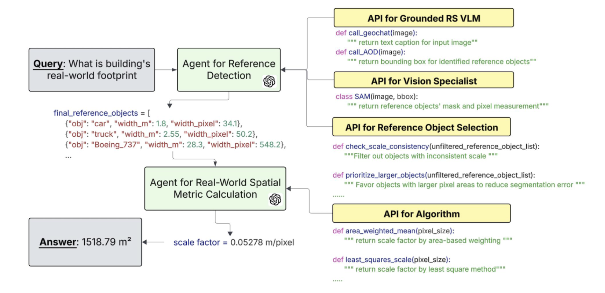

# Visual Agentic System for Spatial Metric Query Answering in Remote Sensing (RS) Images

An agentic AI system that goes beyond state-of-the-art Vision-Language Models (VLMs) to accurately answer spatial metric queries in remote sensing imagery.

🌟 **Accepted at Eurographics 2025 (Poster)**

<p align="center">
  <a href="assets/paper.pdf">
    
  </a>
  &nbsp;&nbsp;
  <a href="assets/poster.pdf">
    
  </a>
</p>

<p align="center">
  
</p>

## Overview

This project introduces an innovative agentic system that achieves automatic scale factor estimation through advanced scene understanding and intelligent reference object detection. By orchestrating multiple AI models (SAM, GPT-4 Vision, and Agentic Object Detection), the system can accurately answer spatial metric queries that current state-of-the-art VLMs struggle with.

## Quick Demo

For a quick demonstration of the system's capabilities, check out the **[demo.ipynb](demo.ipynb)** notebook, which provides interactive examples and visualizations of the spatial metric query answering process.

## Installation

1. Clone the repository:
```bash
git clone https://github.com/yourusername/spatial-query-reasoning-agent.git
cd spatial-query-reasoning-agent
```

2. Install dependencies:
```bash
pip install -r requirements.txt
```

3. Download SAM checkpoint:
```bash
wget https://dl.fbaipublicfiles.com/segment_anything/sam_vit_h_4b8939.pth
```

4. Set up API keys:
```bash
export OPENAI_API_KEY="your-openai-api-key"
export LANDINGAI_API_KEY="your-landingai-api-key"
```

## Usage

### Basic Example

```python
from Agent_reference_detection import ReferenceDetectionAgent
from Agent_spatial_metric_calculation import SpatialMetricCalculationAgent

# Initialize agents
detector = ReferenceDetectionAgent()
calculator = SpatialMetricCalculationAgent()

# Process an image
image_path = "path/to/your/image.jpg"
example_query = "What is the real-world size of the red building in the image?"

# Detect reference objects
reference_objects = detector.run(image_path, example_query)

# Calculate scale
scale_result = calculator.calculate_scale_factor(reference_objects, example_query)
print(f"Scale: {scale_result['scale_factor']:.4f} meters/pixel")
```

## Requirements

- Python 3.8+
- PyTorch
- OpenCV
- OpenAI API key
- LandingAI API key
- CUDA GPU (recommended)

## License

MIT License

## Author

Yinghao (Jasper) Wang - me@wangyinghao.com

## Acknowledgments
- Cheng Wang for guidance and support
- Segment Anything Model (SAM) by Meta AI
- GPT-4 Vision API by OpenAI
- Agentic Object Detection API by LandingAI
